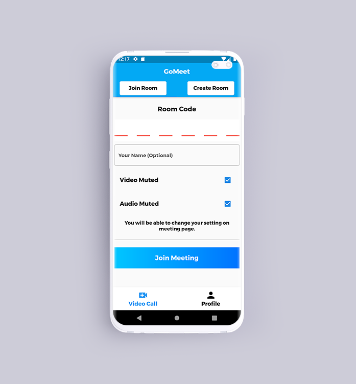
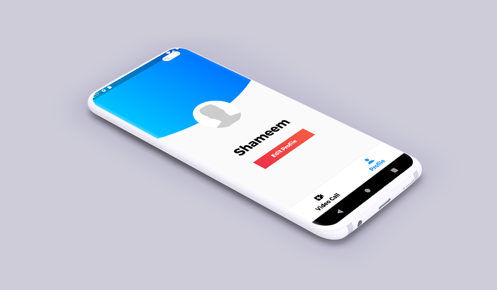

# GoMeet - Flutter Video Conferencing App :camera_flash:

Go ahead, video chat with the whole team. In fact, invite everyone you know. GoMeet is a fully encrypted video conferencing solution that you can use all day, every day, for free.

The source code is **100% Dart**, and everything resides in the [/lib](https://github.com/shameemreza/gomeet/tree/master/lib) folder.

[](https://opensource.org/licenses/Apache-2.0)
[](https://github.com/shameemreza/gomeet/blob/main/LICENSE)

GoMeet is a Video Conferencing Flutter App using Jitsi Meet Plugin. More secure, more flexible, and completely free video conferencing.

"Jitsi Meet is an open-source (Apache) WebRTC JavaScript application that uses Jitsi Videobridge to provide high quality, secure and scalable video conferences." You can learn more information about [Jitsi Meet here](https://github.com/jitsi/jitsi-meet).

## Features :see_no_evil:

- Login and Registration using Firebase
- Create Meeting Room
- Join Meeting Room
- Invite users to a conference via a simple, custom URL
- Pick fun meeting URLs for every meeting
- Trade messages and emojis while you video conference, with integrated chat.
- and More

# Screenshots



## License

```
Copyright 2020 Shameem Reza

Licensed under the Apache License, Version 2.0 (the "License");
you may not use this file except in compliance with the License.
You may obtain a copy of the License at

   http://www.apache.org/licenses/LICENSE-2.0

Unless required by applicable law or agreed to in writing, software
distributed under the License is distributed on an "AS IS" BASIS,
WITHOUT WARRANTIES OR CONDITIONS OF ANY KIND, either express or implied.
See the License for the specific language governing permissions and
limitations under the License.

## Getting Started with Flutter

For help getting started with Flutter, view our online
[documentation](https://flutter.io/).

```
